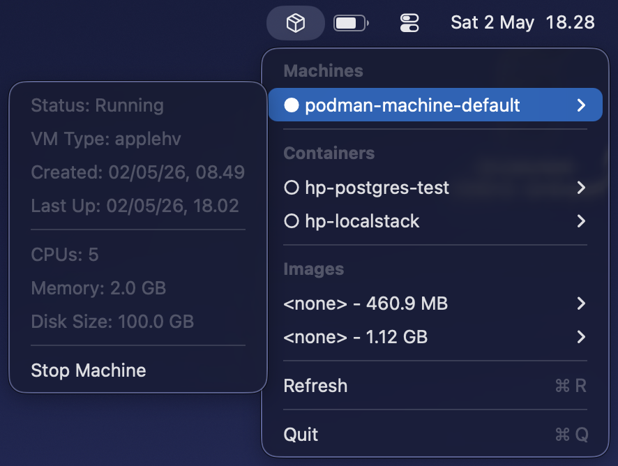

# PodmanBar

[](https://developer.apple.com/macos/)
[](https://swift.org)
[](LICENSE)

A minimal macOS menubar app for managing [Podman](https://podman.io/) machines, containers, and images. For those who don't really pay attention to their machines but required them to run their projects.

> **Note:** This is an unofficial community project and is not affiliated with the Podman project or Red Hat.



Download the dmg file:
[release 1.0.0](https://github.com/brosing/podman-bar/releases/tag/1.0.0)

## Features

- **Menubar-only app**: Runs in the menubar without appearing in the dock
- **Simple Menu Interface**: Native macOS menu with sections and separators
- **Machine Management**: Start and stop Podman machines with visual status indicators
- **Container Overview**: View running containers with port information
- **Image Management**: List available Docker/Podman images
- **On-demand Updates**: Refreshes when menu opens, live updates while menu is visible, manual refresh with ⌘R
- **Clean UI**: Sectioned menu following Apple's HIG guidelines

## Requirements

- macOS 14.6+ (Sequoia)
- Podman installed (auto-detected at common paths)
- Apple Development account for signing

## Installation

1. Clone this repository
2. Open `PodmanBar.xcodeproj` in Xcode
3. Build and run the project
4. The app will appear in your menubar as a cube icon

## Usage

### Menubar Interface

Click the cube icon in your menubar to open the menu:

```
Machines
  ● podman-machine-default ▶
    Running
    CPUs: 5
    ────────────────
    Stop Machine
────────────────
Containers
  ● houp-postgres-test-1 ▶
    Image: docker.io/library/postgres:17
    Status: Up 45 minutes
    Ports: 5434:5432
    ID: 17b99394c252
────────────────
Images
  docker.io/library/postgres:17 - 460.90 MB ▶
    ID: 19b825cafdd2
────────────────
Refresh ⌘R
────────────────
Quit ⌘Q
```

### Menu Structure

1. **Machines Section**
   - Status indicator: ● (running) / ○ (stopped)
   - Click any machine for submenu with details and start/stop actions
   - See CPU count and machine status

2. **Containers Section**
   - List of all containers with status indicators
   - Click any container for submenu with:
     - Image name
     - Current status
     - Port mappings (host:container)
     - Short container ID

3. **Images Section**
   - List of available images (limited to 10)
   - Image name and formatted size
   - Click for image ID

### Controls

- **Refresh**: Press ⌘R or click Refresh to update data (menu stays open)
- **Machine Control**: Hover over a machine and click Start/Stop in submenu
- **Quit**: Press ⌘Q or click Quit to exit the app
- **Live updates**: Status refreshes automatically while menu is open

## Architecture

### Key Components

- `PodmanBarApp.swift`: Main app structure with NSStatusItem and NSMenu
- `PodmanService.swift`: Service layer for executing Podman CLI commands
- `ContentView.swift`: Legacy SwiftUI views (unused in menu mode)

### Data Models

- `PodmanMachine`: Machine information and status
- `PodmanContainer`: Container details with port information
- `PodmanImage`: Image metadata with formatted display helpers
- `PodmanPort`: Port mapping details

### Security

- App sandboxing disabled (required for Podman CLI execution)
- Minimal entitlements
- Template rendering for menubar icon

## Troubleshooting

### Common Issues

1. **"No machines found"**: Ensure Podman is installed and a machine exists
2. **Build failures**: Check Xcode version and signing certificates
3. **Permission errors**: Verify entitlements allow Podman execution

### Podman Setup

```bash
# Install Podman (if not already installed)
brew install podman

# Create a machine (if needed)
podman machine init

# Start the machine
podman machine start
```

## License

This project is licensed under the MIT License - see the [LICENSE](LICENSE) file for details.

## Contributing

Contributions are welcome! Please feel free to submit a Pull Request.

1. Fork the repository
2. Create your feature branch (`git checkout -b feature/amazing-feature`)
3. Commit your changes (`git commit -m 'Add amazing feature'`)
4. Push to the branch (`git push origin feature/amazing-feature`)
5. Open a Pull Request

Please read our [issue templates](.github/ISSUE_TEMPLATE/) for bug reports and feature requests.

## Acknowledgments

- Built with [SwiftUI](https://developer.apple.com/xcode/swiftui/)
- Podman integration via [Podman CLI](https://podman.io/)
- Inspired by the macOS ecosystem of menubar utilities
